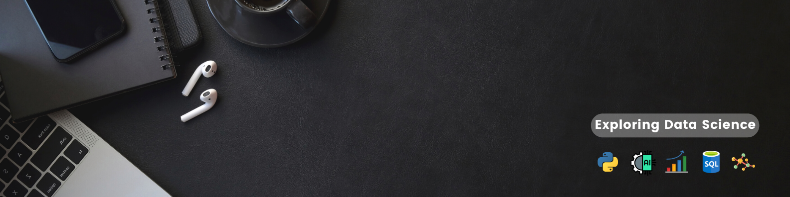

<h1 align="center">Hi there👋</h1>
<h2 align="center">I'm Sanya Virmani, a Data Analyst </h2>

## ✨ About me:
🔭 I’m interested in Data Analytics and Business Intelligence 
🌱 I’m currently learning Machine Learning and Python 
📫 How to reach me sanyavirmani.work@gmail.com 
⚡ Fun fact- I love paying attention to details 

## 💻 Skills:

<ul style="list-style-type:square">
  <li>Python</li>
  <li>SQL</li>
  <li>Advance Excel</li>
  <li>PowerBI</li>
  <li>Data Analysis</li>
  <li>Business Analysis</li>
</ul>

## 👾 Connect with me:

## 📊 GitHub Stats:

